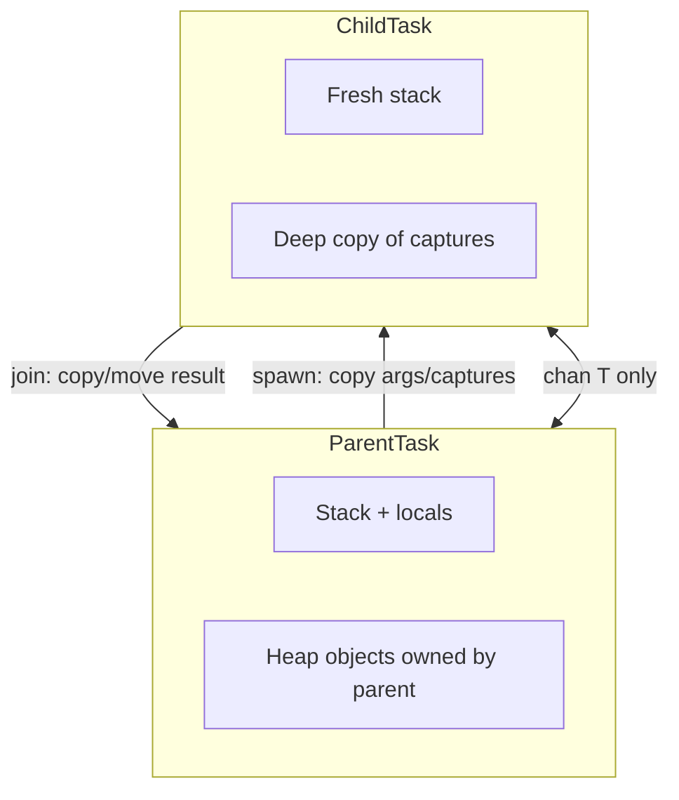
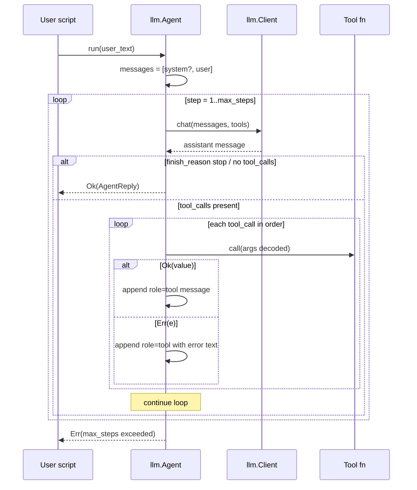
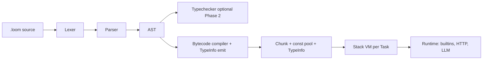
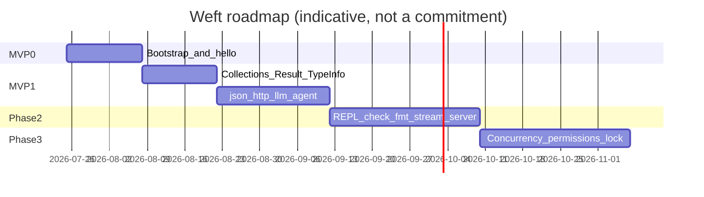
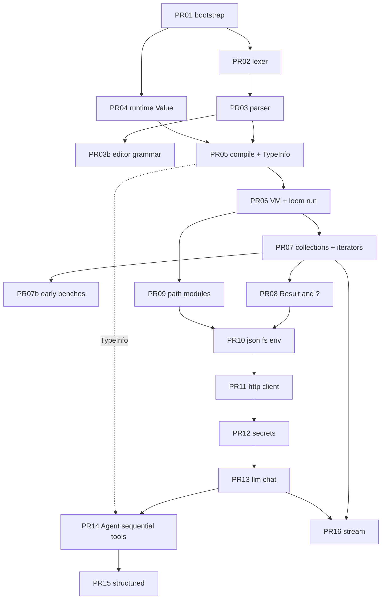

# Weft Language Design Document

| Field | Value |
|-------|--------|
| **Title** | Weft: An LLM-First Scripting Language |
| **Author** | TBD |
| **Date** | 2026-07-25 |
| **Revised** | 2026-07-25 (post-review rev 3; issues 22–30) |
| **Status** | Draft |
| **Repo** | local checkout (product name **Weft**; Go module `github.com/loreste/weft`) |
| **CLI name** | `weft` |
| **File extension** | `.weft` |
| **License (proposed)** | Apache-2.0 |
| **Go module** | `github.com/loreste/weft` |

---

## Overview

Weft is a new scripting language designed for **LLM-centric programming**: agents, tool calling, structured outputs, streaming, and multi-step pipelines—while remaining general enough for CLI tools and simple HTTP services. It targets developers who want **faster cold start**, **multi-core concurrency**, **single-binary distribution**, and **native schema/tool ergonomics** without a heavy agent-framework stack.

The language surface is deliberately approachable (short keywords, low boilerplate) with **brace-delimited blocks** for tooling safety, **gradual typing with structural types** for JSON/schemas, and **Go-style lightweight concurrency** (no async coloring). The compiler and runtime are implemented primarily in **Go** as a **bytecode VM** for v1, shipping as a single `loom` binary.

This revision closes implementability gaps: a **concurrency memory model** (no shared mutable heap across tasks in v1), a **minimal TypeInfo** design for tool/schema reflection, **stream events as tagged structs** (sum types/`match` deferred), a **Language Spec appendix** (EBNF, precedence, methods, `Result`/`?`, `Error`, `main`), honest **MVP-0 / MVP-1 timelines**, and a reworked **PR plan** with acceptance tests.

---

## Background & Motivation

### Current state

LLM application code is often built with heavy agent frameworks. The ecosystem (OpenAI SDK, Anthropic SDK, agent SDKs, RAG frameworks, schema libraries, multi-provider routers) is mature, but the host language carries liabilities that hurt agent workloads. Weft’s response is **not** “eliminate every host-language pain on day one”; it is to eliminate some, improve others, and defer the rest honestly:

| Pain point | Why it hurts LLM/agent work | Weft v1 status |
|------------|-----------------------------|----------------|
| **Slow cold start** | Serverless, CLI agents, short-lived tool runners pay 50–300ms+ before logic runs | **Eliminated (target)**: single binary, no site-packages import tax |
| **Shared interpreter lock** | Parallel tool calls / multi-agent work fight for one core | **Improved in Phase 3**: goroutine tasks with **no shared mutable heap** (see §1.5); MVP Agent runs tools **sequentially** |
| **async/await coloring** | Tool + HTTP + stream pipelines become colored functions | **Eliminated (design intent)**: `spawn`/`TaskGroup` without function colors |
| **Packaging hell** | native wheels, schema-lib drift, native deps, environment drift | **Improved, not eliminated**: stdlib is **in the binary** (no external package manager for core); third-party Weft modules still need a resolution story (path/`LOOM_PATH` in v1; lockfile in v1.1). Not “no packaging forever.” |
| **Dynamic typing tax** | Structured outputs bolted on; slow runtime discovery | **Improved with annotations**: runtime stays dynamic; schema/tool wins require **annotations + TypeInfo** (§2.2a). Unannotated code is as unstructured as untyped scripts. |
| **Hard embedding** | embedding a full second runtime is heavy; global interpreter state | **Eliminated (relative)**: `pkg/loom` Context API |
| **Indentation-only structure** | LLM codegen and some tools introduce silent bugs | **Eliminated**: required braces |

### Why a new language (not “same language but faster”)

- **Mojo / Julia / etc.** optimize numerics, not agent I/O and schema binding.
- **TypeScript** is strong for structured types and HTTP, but Node cold start, single-threaded event loop defaults, and npm complexity remain.
- **Go itself** is excellent for servers but verbose and awkward for interactive agent scripting and REPL-driven prompt iteration.
- **A purpose-built scripting layer on a Go VM** can offer scripting authoring speed with Go-like ops characteristics, and **LLM primitives in stdlib** instead of library afterthoughts.
- **Forking Risor/Tengo/Starlark** was considered and rejected for the product surface (see Alternatives A6)—ideas may still be borrowed.

### Design posture

Ship a **small, honest language**: excellent at scripts, agents, JSON, HTTP client/server, and concurrency—not a research PL or a general-purpose OS scripting replacement. Prefer boring, proven implementation choices (recursive-descent parser, stack VM, Go `net/http`) over novel IR research. **Ruthlessly subset MVP language features** so agent-with-tools ships without ADTs, full typechecker, or remote imports.

---

## Goals & Non-Goals

### Goals

| # | Goal | When |
|---|------|------|
| 1 | **Startup**: `loom run hello.loom` wall time to print < **15ms** on a warm laptop (no network) | MVP-0 |
| 2 | **Ease**: a developer can read Weft in minutes | MVP-0 |
| 3 | **REPL** for prompt/tool iteration | Phase 2 (not MVP-1 gate) |
| 4 | **LLM-native**: messages, tools, sequential Agent loop, streaming (tagged events), structured decode | MVP-1 (stream + structured may trail Agent by 1–2 PRs) |
| 5 | **Concurrency**: `spawn` / `TaskGroup` / channels; **no shared mutable heap across tasks** | Phase 3; not required for MVP-1 Agent |
| 6 | **Parallel tool fan-out** via TaskGroup | Phase 3 (MVP-1 tools are **sequential**) |
| 7 | **Distribution**: single binary; `loom run`; shebang; stdlib in binary | MVP-0 |
| 8 | **Web (minimal)**: HTTP client (MVP-1) + small server (Phase 2) | as noted |
| 9 | **Safety basics**: optionals, `Result`/`?`, secret redaction; finite HTTP/agent defaults | MVP-1 |

### Non-Goals (explicitly out of v1 and near-term)

- Full foreign-language syntax or bytecode compatibility
- Complete NumPy/pandas compatibility and vendor-specific kernels in core (use `warp`, `dataframe`, and explicit native accelerator plugins)
- Browser/WASM story as a deliverable
- JIT or LLVM native codegen in v1
- Full OOP inheritance hierarchies / metaclasses
- Algebraic data types + exhaustiveness checking in MVP (Phase 2+)
- Guaranteed compute speedups vs baseline scripting runtimes before `bench/` lands (see §3.5)
- Multi-provider “framework-complete” agent framework (adapters + primitives only)
- Distributed cluster runtime
- Capability sandbox as an MVP gate (post-MVP-1 flags)

---

## Key Decisions

| # | Decision | Choice | Rationale |
|---|----------|--------|-----------|
| 1 | **Language name** | **Weft** (`loom`, `.loom`) — provisional | Short; pipeline metaphor. Final name blocks PR 01 merge (OQ1). |
| 2 | **Syntax style** | short keywords + **required braces**; no semicolons | Familiar + tooling-safe; no indentation-only mode in v1. |
| 3 | **Type system** | **Gradual + structural**; local inference; annotations optional | JSON/LLM fit; runtime dynamic unless `loom check`. |
| 4 | **Null / errors** | `T?`; **`Result[T, Error]` + `?`**; single `Error` type | Predictable I/O/model failures; maps to Go `error`. |
| 5 | **Concurrency + memory model** | Goroutine tasks; **no shared mutable heap across tasks in v1**; channels + **copied** TaskGroup results | Avoids data races without a concurrent GC story; still multi-core for independent I/O. See §1.5. |
| 6 | **Execution model v1** | **Bytecode stack VM in Go** | REPL, embed, single binary; AOT deferred. |
| 7a | **Modules v1** | **Path + `LOOM_PATH` + stdlib in binary**; optional local `vendor/` | No remote fetch in v1; avoids supply chain until lockfile exists. |
| 7b | **Modules v1.1** | URL imports + `loom.lock` + content-addressed cache | Reproducible third-party deps when needed. |
| 8 | **LLM surface** | `llm` stdlib; OpenAI-compat first; tools need **TypeInfo** | Small language; 80% path optimized. |
| 9 | **Web v1** | Thin `net/http` bindings | Client MVP-1; server Phase 2. |
| 10 | **Performance claims** | **Advertise startup + parallel I/O first**; compute **do not claim 2–10× until `bench/`** | Naïve Go VMs often land near common scripting runtimes on pure compute; avoid marketing risk. |
| 11 | **Sum types / match** | **Deferred to Phase 2**; v1 uses **tagged structs** for streams/content | Keeps MVP parser small; hero examples stay implementable. |
| 12 | **Stdlib implementation v1** | **All stdlib is Go-registered builtins** | No `.loom` stdlib files until Phase 2 loader is solid. |
| 13 | **Methods** | Dot-call is **method sugar** via type-id registry (`recv.m(args)` → `Type_m(recv, args)`) | Matches examples (`resp.text()`) without full OOP. |
| 14 | **Agent tools MVP** | **Sequential** execution of tool_calls | Parallel after TaskGroup (Phase 3). |
| 15 | **Tool binding** | `llm.tool` → **`ToolBinding{spec, fn}`**; `ToolSpec` is wire-only | Agent needs callable + schema without overloading ToolSpec. |
| 16 | **return + Result** | No re-wrap if expr is already `Result[T]`; bare `T` → `Ok(T)` | Prevents `Result[Result[T]]` in spawn/http pipelines. |
| 17 | **Type reification** | Type names in expr position → `TypeInfo` value | Enables `structured(WeatherQuery, …)` without string-only API. |

---

## Proposed Design

### 1. Language surface

#### 1.1 Lexical & syntactic style

- UTF-8 source, LF preferred
- Comments: `// line` and `/* block */`
- Identifiers: `[A-Za-z_][A-Za-z0-9_]*`
- Naming convention (style, not enforced): modules/`snake_case`, types `PascalCase`
- **Keywords (v1 MVP subset):** `fn`, `let`, `const`, `mut`, `if`, `else`, `for`, `in`, `while`, `return`, `break`, `continue`, `type`, `struct`, `import`, `as`, `true`, `false`, `null`, `pub`, `defer`
- **Keywords reserved for Phase 2+ (lexer may reject or reserve):** `match`, `enum`, `spawn`, `select`, `try`, `catch`, `interface`
- **Removed from v1 surface:** `await` (use `handle.join()` / `group.wait_all()` only); `export` (use **`pub` only**); `interface` as syntax (see §2.4 for Go-side adapter interface only)
- Blocks: `{ ... }` **required**
- Strings: `"..."` escapes; `` `raw` ``; legacy f-style (if present): `f"hello {name}"` (expression inside `{}` is full expr in parser)
- Collections: `[1, 2]`, `{"k": v}` — **no set literal in v1** (use `Map` as set-of-keys if needed; `setOf` deferred)
- Unit type: written **`unit`** in type position; value is **`()`** only as empty return sugar — prefer **`void` returns**: `fn main()` means no useful return. For `Result`, use **`Result[unit]`** where unit is a distinct empty struct predefined as `type unit = struct {}` and value `unit{}`. See Appendix A.

#### 1.2 Concrete syntax examples

**Hello world**

```loom
// hello.loom
fn main() {
    println("hello, loom")
}
```

**Types, optionals, Result**

```loom
fn parse_age(s: str) -> Result[int] {
    let n = int.parse(s)?   // method sugar → int_parse(s); see Appendix B
    if n < 0 {
        return Err(Error.new("age must be non-negative"))
    }
    return Ok(n)            // explicit Ok; see §1.4 return rules
}

fn greet(name: str?) {
    let n = name ?? "world"
    println(f"hello, {n}")
}
```

**Concurrency (Phase 3 — not MVP)**

```loom
fn fetch_all(urls: [str]) -> Result[[str]] {
    let group = TaskGroup.new()
    for url in urls {
        // each spawn receives *copied* arguments; no shared mut maps
        let u = url
        group.spawn(fn() {
            // ?.text() yields Result[str]; return does NOT re-wrap (see §1.4 A.4)
            return http.get(u)?.text()
        })
    }
    return group.wait_all()  // already Result[[str]]; no re-wrap
}
```

**HTTP server (Phase 2)**

```loom
import http

fn main() {
    http.serve(":8080", fn(req) {
        if req.path == "/health" {
            return http.json_response(200, {"ok": true})
        }
        return http.text_response(404, "not found")
    })
}
```

**LLM agent with tools + structured output (MVP-1)**

```loom
import llm
import secrets

type WeatherQuery {
    city: str
    units: str   // default applied in schema via TypeInfo default, see §2.2a
}

type WeatherResult {
    city: str
    temp_c: float
    summary: str
}

fn get_weather(city: str, units: str) -> Result[WeatherResult] {
    return Ok(WeatherResult{
        city: city,
        temp_c: 21.5,
        summary: "clear",
    })
}

fn main() -> Result[unit] {
    let client = llm.client({
        "provider": "openai_compat",
        "base_url": env.get("LLM_BASE_URL") ?? "https://api.openai.com/v1",
        "api_key": secrets.require("OPENAI_API_KEY")?,  // Result[Secret]
        "model": "gpt-4o-mini",
    })

    // llm.tool returns ToolBinding { spec, fn } — see §2.1
    let agent = llm.Agent.new({
        "client": client,
        "system": "You are a helpful weather assistant.",
        "tools": [
            llm.tool("get_weather", get_weather, {
                "description": "Get current weather for a city",
            }),
        ],
        // defaults if omitted: max_steps=20, max_tool_calls=40, step_timeout=60s
    })

    let reply = agent.run("What's the weather in Paris?")?
    println(reply.text)

    // WeatherQuery is a type name: in expr position it evaluates to TypeInfo (§1.3)
    let q = client.structured(WeatherQuery, {
        "messages": [
            llm.user("Extract the city from: weather please in Tokyo"),
        ],
    })?
    println(q.city)
    return Ok(unit{})
}
```

**Streaming (tagged structs — no match/ADT in v1)**

```loom
fn main() -> Result[unit] {
    let client = llm.client_from_env()
    // stream() returns Result[Iter[StreamEvent]]; ? fails setup only
    let events = client.stream({
        "messages": [llm.user("Write a haiku about goroutines")],
    })?
    for event in events {
        // mid-stream provider failures become kind == "error" events (not for-break)
        if event.kind == "text_delta" {
            print(event.text)
        } else if event.kind == "tool_call" {
            println(f"\n[tool] {event.tool_call.name}")
        } else if event.kind == "done" {
            println(f"\n tokens={event.usage.total_tokens}")
        } else if event.kind == "error" {
            return Err(event.error)
        }
    }
    return Ok(unit{})
}
```

#### 1.3 Type system

- **Dynamic by default** at runtime (tagged `Value`s) for REPL speed and rapid scripting.
- **Optional static checking** via annotations and `loom check` / `--strict` (Phase 2).
- **Local type inference** for `let x = ...` when RHS is unambiguous (checker only).
- **Structural typing** for `struct` shapes when checking/decoding JSON.
- **Type aliases (v1):** `type UserId = str` and `type unit = struct {}` (empty struct). Both forms are in the EBNF (Appendix A.2).
- **Type names as values (reification, normative):** In **expression position**, an identifier that names a type in the **module type registry** evaluates to a `TypeInfo` value (runtime tag `TypeInfo`). This enables:
  ```loom
  client.structured(WeatherQuery, req)   // WeatherQuery → TypeInfo
  schema.of(WeatherQuery)
  json.decode(WeatherResult, s)
  ```
  Shadowing: if a local/param/`let` binding has the same name, the **value binding wins** (types are not in the same namespace as values after a value binding is introduced). Prefer PascalCase types and avoid shadowing. String form is also accepted: `client.structured("WeatherQuery", req)` looks up the registry by name.
- **Generics (v1 limited):** builtin only — `Result[T]`, `T?` (optional), `[T]` lists, `Map[K,V]`, `Iter[T]`. **No user-defined generic functions in MVP.**
- **No union/`enum`/`match` in MVP.** Phase 2 adds sum types; until then use tagged structs (`kind: str` + optional payload fields).
- **Struct field defaults (v1):** optional in type syntax: `units: str = "metric"`. At runtime, missing fields in struct literals are filled from TypeInfo defaults when constructing via `decode`/`struct_new`; explicit literal omission uses default if TypeInfo has one, else type error under `--strict`, else runtime error on required field.

#### 1.4 Null safety, mutability, error handling

**Null / optional**

- `null` is only legal for `T?`.
- `??` provides defaults: `name ?? "world"`.
- Under `loom check`, assigning `null` to non-optional is an error. At runtime without check, opcode may panic on explicit non-optional store of null (documented as programming error).

**Mutability (normative — value mutability ⟂ binding mutability)**

In v1, **binding mutability and value mutability are independent** (Go-like, not Rust-like):

| Binding | Rule |
|---------|------|
| `let x = v` | Binding **immutable**: cannot reassign `x = ...`. **May** still mutate the value in place if it is a collection/struct: `x.field = ...`, `x["k"] = ...`, `x.push(...)` are **allowed**. |
| `let mut x = v` | Binding **reassignable**: `x = other` is allowed, and in-place mutation is allowed. |
| `const X = v` | Compile-time constant (literals / pure constant expressions only). **No** reassignment and **no** in-place mutation through `X` (values should be deeply immutable scalars or frozen at bind; v1 only allows scalar/string const). |

Examples:

```loom
let s = Point{ x: 1, y: 2 }
s.x = 3          // OK — field mutation through immutable binding
// s = Point{ x: 0, y: 0 }  // ERROR — reassignment needs let mut

let mut t = s
t = Point{ x: 0, y: 0 }   // OK

let m = { "a": 1 }
m["b"] = 2       // OK — map is mutable in place within a task
```

**Across tasks:** sharing mutable collections is prevented by deep-copy-on-spawn (see §1.5), not by `let` vs `let mut`.

**Error type (normative)**

```loom
type Error {
    message: str
    kind: str          // e.g. "http", "llm", "validation", "user", "timeout", "cancel"
    code: str?         // provider or HTTP code
    cause: Error?      // wrap chain
    // stack is runtime-only; not a script-visible field in v1 unless Error.stack()
}
```

- `Ok(v)` / `Err(e)` construct `Result[T]` (sugar for Result with `Error` as fixed error type in v1: **`Result[T]` means `Result[T, Error]`**).
- `Error.new(message: str) -> Error` with `kind: "user"`.
- Builtins set `kind` appropriately (`"http"`, `"llm"`, …).
- `fmt`/`println` of Error print `message` (and kind); secrets never appear in Error messages by construction of stdlib.

**`?` operator (normative desugaring)**

In a function declared `-> Result[T]`:

```text
expr?
// desugars to approximately:
{
    let __r = expr
    if !is_result(__r) { panic("? on non-Result") }
    if __r.is_err() { return Err(__r.err()) }
    __r.unwrap()
}
```

- `?` **always returns from the innermost enclosing function**, never from an outer spawn parent.
- Using `?` in a function not returning `Result[...]` is a compile error under check; runtime panic otherwise.
- Inside `group.spawn(fn() { http.get(u)? })`, `?` returns `Err` from the **spawned** fn; TaskGroup records that child result.

**`return` + `Result` wrapping (normative — no double wrap)**

In a function with return type `Result[T]`:

| `return e` where runtime/static kind of `e` is… | Semantics |
|-------------------------------------------------|-----------|
| `Result[T]` (same ok-type) | Use `e` **as-is** as the function outcome. **Do not** wrap again. |
| `T` (success payload, not a Result) | Desugar to `return Ok(e)`. |
| `Result[U]` where `U ≠ T` | Type error under `loom check`; runtime panic if unchecked and kinds mismatch. |
| bare `Error` | Desugar to `return Err(e)`. |
| other | Type/runtime error. |

In a function with **non-Result** return type `T`:

| `return e` | Semantics |
|------------|-----------|
| `e` has kind `T` | Function result is `e`. |
| `e` is `Result[_]` | Error (do not auto-unwrap; use `?` or explicit handling). |

Implications:

```loom
fn f() -> Result[str] {
    return http.get(u)?.text()  // .text() is Result[str] → returned as-is (no Result[Result[str]])
}
fn g() -> Result[int] {
    return 42                   // desugars to return Ok(42)
}
fn h() -> Result[int] {
    return Ok(42)               // as-is
}
fn bad() -> Result[str] {
    return http.get(u)?.text()? // after ?, type is str → desugars to return Ok(str); also valid
}
```

Prefer either explicit `Ok`/`Err` or returning a `Result`-producing call; both are legal under the table above. **Never** auto-wrap an existing `Result`.

**`defer`**

- `defer call(...)` schedules the call to run at **function** exit (LIFO), including on `return` / `?` early return / fallthrough. Args are evaluated at the `defer` site. Requires a call expression (not bare values).

#### 1.5 Concurrency model and memory model (normative)

**MVP / MVP-1:** no `spawn` in language surface. Agent tools run **sequentially** on the main VM task.

**Phase 3 concurrency**

Inspired by Go and structured concurrency, with a **strict v1 memory model** to ship race-free under `go test -race`:

| Primitive | Semantics |
|-----------|-----------|
| `spawn(fn) -> JoinHandle` | New goroutine runs `fn` with a **fresh VM call stack** and **deep-copied** captured closed-over values that are collections/structs (see below). |
| `handle.join() -> Result[T]` | Wait for child; result is owned by caller. |
| `TaskGroup` | Parent waits for all children; **default policy: fail-fast** (first Err cancels siblings via context). |
| `chan[T]` | Go channel of **Values**; send **transfers** ownership of that Value reference to the receiver’s task. Prefer channels over shared heap. |
| `select { ... }` | Multiplex channel ops + timeout (Phase 3). |

##### Memory model (Key Decision #5) — pick: **no shared mutable heap across tasks**

1. **Isolated stacks:** each task has its own call frames and operand stack. The VM execution engine for a task is **not shared**; multiple tasks run as separate goroutines each owning a `Task` state. Shared process-global state is limited to: interned const pool (immutable), builtin function pointers, and explicitly shared channel endpoints.
2. **Capture / argument policy at `spawn`:**
   - Immutable scalars (`int`, `float`, `bool`, `str`, `null`, `unit`) are copied by value (strings are immutable; share backing bytes OK).
   - `List`, `Map`, `Struct` instances reachable from captures/args are **deep-copied** at spawn boundary (v1). Mutation in parent or child does not race.
   - `Func` closures: the function bytecode is shared (immutable); upvalues are copied per above rules at spawn.
   - `Native` handles (HTTP clients, open files): **not deep-copied**; either rejected at spawn (`Err` kind `"concurrency"`) or documented as **unsafely shared** only if marked `Shareable` (v1: **reject** non-shareable natives across spawn).
   - `chan` values may be shared by reference (they are the coordination primitive).
3. **Channels preferred** for ongoing cross-task communication; payloads follow transfer/copy on send (v1: **deep-copy on send** for collections to keep model simple; optimize later).
4. **TaskGroup aggregation:** `wait_all()` builds a **new list** of child results; children must not retain aliases to parent builders.
5. **No VM-global interpreter lock that serializes all tasks** for correctness—parallelism is real. There is **no** fine-grained locking of Weft heaps because **sharing mutable heaps is disallowed**.
6. **Race testing:** all concurrency tests run with `-race`. Document that breaking the model (future “unsafe share”) is out of v1.
7. **Agent parallel tools (Phase 3):** when enabled, each tool call runs in a TaskGroup child with deep-copied args; results merged in call order for the messages list.



**Why this still beats shared-lock scripting hosts for agents (Phase 3):** 50 independent HTTP tool calls each own their state and block in Go’s netpoller on different OS threads as needed—no shared Weft map writes.

#### 1.6 Module system

```loom
import http                    // bare ident → stdlib package name
import http as h               // alias
import "./lib/util.loom"       // string → file path (relative/absolute)
// v1.1 only:
// import "github.com/acme/loom-tools@v0.3.0"
```

**Resolution (normative):**

| Form | Meaning |
|------|---------|
| `import ident` | Resolve `ident` as a **stdlib package** registered by the Go runtime (e.g. `http`, `json`, `llm`, `secrets`, `fs`, `env`, `os`, `time`). Unknown bare name → compile/load error. |
| `import string` | Resolve as a **filesystem path** (relative to current file or absolute). Must end in `.loom` in v1. Loaded as a user module. |
| `import X as y` | Bind the module/package object to name `y`. |

- **v1:** stdlib bare names + path strings + `LOOM_PATH` (search path for non-relative path strings). No URL imports.
- **v1.1:** versioned remote imports (string URLs), `loom.lock` (hashes), cache under `~/.cache/loom`.
- Each file is a module; **`pub`** marks exports. Unexported names are file-private.
- `fn main` entry in the root package only (the file passed to `loom run`).

**Prelude / bootstrap (normative)**

- `println`, `print`, `Ok`, `Err`, `Error`, operators, and core types are **compiler/VM intrinsics** injected into every module scope (no import required).
- `import http` etc. bind package objects registered by the Go runtime.
- There is **no** `std/prelude.loom` file in v1 (Key Decision #12).

#### 1.7 Method resolution

```text
recv.method(args...)
// 1. If recv is a package object, look up package member.
// 2. Else look up method registry: methods[type_id(recv)][method]
// 3. Invoke as builtin/fn(recv, args...)
// 4. Else error: "no method method on Type"
```

User-defined methods on structs in v1: **not supported**. Only stdlib/builtins register methods (`Response.text`, `TaskGroup.spawn`, …). User code uses package functions or free functions.

UFCS (Universal Function Call Syntax) for user fns is **out of v1**.

#### 1.8 Equality and map keys (v1)

| Type | `==` | Usable as Map key |
|------|------|-------------------|
| null, bool, int, float, str | value equality (float: IEEE) | yes (except float discouraged; allowed) |
| List, Map, Struct | deep value equality | **no** (runtime error on insert) |
| Func, Chan, Native, Secret | identity only | no |
| Result | equal if both Ok and values `==`, or both Err and errors `==` | no |

Hashing for map keys matches `==` for allowed key types.

#### 1.9 Iteration protocol (normative)

```text
for x in expr {
    body
}
// desugars to:
{
    let __it = iter_of(expr)       // List/Map/Iter/str → Iter
    loop {
        let __n = __it.next()      // -> T?   (null = end)
        if __n == null { break }
        let x = __n
        body
    }
}
```

**`Iter[T]` protocol (runtime):** any object with method `next() -> T?` where `null` means exhausted.

**Stream + Result interaction:**

- `client.stream(req) -> Result[Iter[StreamEvent]]`
- `let events = client.stream(req)?` — `?` applies only to **opening** the stream (HTTP setup / 4xx before body).
- Mid-stream failures yield a **`StreamEvent` with `kind: "error"`** and `error: Error`; they do **not** throw out of `for`. Callers must check `kind` (see streaming example).
- Iterator protocol lands in **PR 07** (collections); stream implements same protocol in **PR 16**.

---

### 2. LLM-first features (language + stdlib)

#### 2.1 Core types (`llm` package) — v1 tagged structs

```loom
// Roles as strings in v1: "system" | "user" | "assistant" | "tool"

type Message {
    role: str
    content: str              // multipart content deferred; images Phase 2
    name: str?
    tool_call_id: str?
    tool_calls: [ToolCall]?   // assistant messages may include
}

// JSON-Schema-facing description sent to the provider (no callable).
type ToolSpec {
    name: str
    description: str
    parameters: Map[str, any] // JSON Schema object
}

// Runtime binding: schema + callable. Returned by llm.tool; held by Agent.
type ToolBinding {
    spec: ToolSpec
    fn: Func              // annotated function; TypeInfo on Func
}

type ToolCall {
    id: str
    name: str
    arguments: Map[str, any]
}

type Usage {
    prompt_tokens: int
    completion_tokens: int
    total_tokens: int
}

type AgentReply {
    text: str
    messages: [Message]
    usage: Usage
}

// Stream events: tagged struct, not ADT
type StreamEvent {
    kind: str                 // "text_delta" | "tool_call" | "done" | "error"
    text: str?                // kind == "text_delta"
    tool_call: ToolCall?      // kind == "tool_call"
    usage: Usage?             // kind == "done"
    error: Error?             // kind == "error"
}

type ChatRequest {
    model: str?
    messages: [Message]
    tools: [ToolSpec]?    // provider wire format only (specs, not bindings)
    temperature: float?
    timeout_ms: int?      // per-request timeout; Agent sets from step_timeout
    // provider-specific passthrough:
    extra: Map[str, any]?
}

type ChatResponse {
    message: Message
    usage: Usage?
    finish_reason: str?
}
```

Helpers: `llm.user(text)`, `llm.system(text)`, `llm.assistant(text)`, `llm.tool_result(tool_call_id, content_str)`.

#### 2.2a TypeInfo — runtime type descriptors (normative)

Without TypeInfo, tool reflection and `structured` cannot work. The compiler and/or value factory attach metadata:

```text
TypeInfo =
  | Scalar{ kind: bool|int|float|str|any|unit }
  | Optional{ inner: TypeInfo }
  | List{ elem: TypeInfo }
  | Map{ key: TypeInfo, val: TypeInfo }
  | Struct{
      name: str,
      fields: [{
        name: str,
        ty: TypeInfo,
        optional: bool,
        default: Value?,    // from `= expr` if constant
        required: bool      // for JSON Schema
      }]
    }
  | Result{ ok: TypeInfo }  // err is always Error
  | Func{
      name: str,
      params: [{ name: str, ty: TypeInfo }],
      ret: TypeInfo,
    }
  | TypeRef{ name: str }    // resolved via module type registry
```

**Rules**

1. Every `fn` with **parameter and return annotations** gets a `Func` TypeInfo on the function Value at compile time (emitted into const pool / function object).
2. Every `type`/`struct` declaration registers a `Struct` TypeInfo in the module type registry under its name.
3. `llm.tool(name, fn, meta) -> ToolBinding`:
   - Requires `fn` TypeInfo with annotated params; **unannotated params → hard error** at tool registration (not silent `any` for LLM tools).
   - Return type should be `Result[T]` or `T`; if `Result[T]`, schema describes `T` and Err becomes tool error content.
   - Nested structs in params must be registered types or inline structural annotations.
   - Builds `ToolSpec` (name, description from meta, parameters from TypeInfo) and stores **`fn` on `ToolBinding`** (not on `ToolSpec`).
4. `schema.of(type_info)` resolves TypeInfo → JSON Schema draft subset. `type_info` may be a reified type name or string (see §1.3).
5. `client.structured(type_info, req)` uses TypeInfo for schema + decode. Same reification rules.

**Example: derived schema for `get_weather`**

```loom
fn get_weather(city: str, units: str) -> Result[WeatherResult]
```

Derived tool parameters schema:

```json
{
  "type": "object",
  "properties": {
    "city": { "type": "string" },
    "units": { "type": "string" }
  },
  "required": ["city", "units"],
  "additionalProperties": false
}
```

If `units: str = "metric"` on a **struct** used as single-arg tool payload, default appears as JSON Schema `"default": "metric"` and may be omitted from `required`.

**Compiler obligation:** PR 05/07 emit TypeInfo for annotated fns and struct types; PR 14 depends on this.

#### 2.2 Schema & structured outputs

- JSON Schema subset: object, array, string, number, integer, boolean, null, required, enum, default, local properties only (no remote `$ref` in v1).
- Validation errors: `Error` with `kind: "validation"`, message includes JSON path (`$.city: expected string`).
- Provider path: prefer `response_format` / JSON mode when available; always validate client-side after parse.

#### 2.3 Tools & agents — normative Agent loop

**MVP-1: sequential tools only. OpenAI-compatible provider only.**



**Construction:** `llm.Agent.new(opts)` expects `tools: [ToolBinding]`. Internally:

```text
self.bindings: Map[str, ToolBinding]   // name → binding (spec + fn)
self.tool_specs: [ToolSpec]            // [b.spec for b in tools] for ChatRequest.tools
```

**Pseudocode** (normative control flow; helpers inlined — not separate public APIs)

```text
fn Agent.run(self, user_text: str) -> Result[AgentReply] {
    let messages: [Message] = []
    if self.system != null {
        messages.push(llm.system(self.system))
    }
    messages.push(llm.user(user_text))
    let tool_calls_total = 0
    // Usage accumulation is field-wise (no Usage.zero/add API required)
    let mut usage_acc = Usage{ prompt_tokens: 0, completion_tokens: 0, total_tokens: 0 }

    for step in range(1, self.max_steps + 1) {
        // Timeout is a ChatRequest field / client context deadline — not a fluent method
        let resp = self.client.chat(ChatRequest{
            messages: messages,
            tools: self.tool_specs,
            model: self.model,
            timeout_ms: self.step_timeout_ms,   // default 60_000
        })?
        if resp.usage != null {
            usage_acc.prompt_tokens += resp.usage.prompt_tokens
            usage_acc.completion_tokens += resp.usage.completion_tokens
            usage_acc.total_tokens += resp.usage.total_tokens
        }
        messages.push(resp.message)

        let calls = resp.message.tool_calls ?? []
        if len(calls) == 0 {
            // message text = content string on assistant message
            return Ok(AgentReply{
                text: resp.message.content,
                messages: messages,
                usage: usage_acc,
            })
        }
        for tc in calls {
            tool_calls_total += 1
            if tool_calls_total > self.max_tool_calls {
                return Err(Error.new("max_tool_calls exceeded").with_kind("llm"))
            }
            let binding = self.bindings[tc.name]
            if binding == null {
                // unknown tool: continue with error content for the model
                messages.push(Message{
                    role: "tool",
                    tool_call_id: tc.id,
                    content: json.stringify({"error": "unknown tool", "name": tc.name})?,
                })
                continue
            }
            let args_ok = decode_args(binding.fn.type_info, tc.arguments)
            let result = call(binding.fn, args_ok)  // Result[any]
            let content: str
            if result.is_ok() {
                content = json.stringify(result.unwrap())?
            } else {
                let e = result.err()
                content = json.stringify({"error": e.message, "kind": e.kind})?
            }
            messages.push(Message{
                role: "tool",
                tool_call_id: tc.id,
                content: content,
            })
        }
    }
    return Err(Error.new("max_steps exceeded").with_kind("llm"))
}
```

**Defaults**

| Parameter | Default |
|-----------|---------|
| `max_steps` | `20` |
| `max_tool_calls` | `40` |
| `step_timeout` | `60s` |
| tool concurrency | **sequential** (MVP-1) |
| on tool `Err` | append tool message with error JSON; **do not** abort Agent (model may recover) |
| on HTTP 429 | **no auto-retry in MVP-1** (return Err kind `llm` / `http`); Phase 2 backoff |
| cancellation | `context` cancel / `Context.Interrupt` aborts in-flight HTTP and returns `kind: "cancel"` |

**Message list ownership:** Agent owns a private `messages` list (mutated during `run`). `AgentReply.messages` is a copy returned to the caller. Re-entrant `run` on same Agent instance is sequential-only (mutex or document “not concurrent”).

**Multi-provider:** PR 14 implements OpenAI-compat only. Anthropic tool_use mapping is PR 23.

**Fixture test table (normative for PR 14)**

| Case | Expect |
|------|--------|
| No tools, plain answer | one chat call; Ok text |
| One tool call then answer | two chat calls; tool message present |
| Tool returns Err | tool message contains error; loop continues |
| `max_steps` exceeded | Err kind `llm` |
| Unknown tool name | tool error content; continue or Err — **choose: continue with error content** |

#### 2.4 Providers

**Language-level:** no `interface` keyword. Adapters are Go types registered as package methods.

Conceptual contract (implemented in Go, exposed as Weft client object):

```text
Client methods:
  chat(req: ChatRequest) -> Result[ChatResponse]
  stream(req: ChatRequest) -> Result[Iter[StreamEvent]]
  structured(type_info: TypeInfo|str, req) -> Result[any]  // reified type name or string
```

| Adapter | When | Notes |
|---------|------|--------|
| OpenAI-compatible | MVP-1 | OpenAI, proxies, many locals |
| Anthropic Messages | Phase 2 / PR 23 | tool_use blocks |
| xAI | PR 23 | compat or thin wrap |
| Ollama / local | MVP-1 via base_url | OpenAI-compat |

#### 2.5 Secrets

```loom
import secrets
let key = secrets.require("OPENAI_API_KEY")?  // Result[Secret]; kind "secrets" if missing
// Secret redacts in println/debug
```

#### 2.6 Prompt helpers

```loom
let msgs = [
    llm.system("You are concise."),
    llm.user(f"Summarize: {doc}"),
]
```

File-based prompt templates: Phase 2.

---

### 3. Implementation architecture (Go)

#### 3.1 Pipeline



| Stage | Package | Notes |
|-------|---------|-------|
| Lexer | `internal/lex` | Hand-rolled; positions |
| Parser | `internal/parse` | Recursive descent; MVP EBNF (Appendix A) |
| AST | `internal/ast` | Nodes + `Pos` |
| Typecheck | `internal/types` | Phase 2; incremental |
| Compiler | `internal/compile` | AST → bytecode + TypeInfo |
| VM | `internal/vm` | Stack machine; **one Task state per goroutine** |
| Runtime | `internal/runtime` | Values, builtins, TypeInfo registry |
| CLI | `cmd/loom` | `run`, later `repl`, `check`, `fmt` |
| Embed | `pkg/loom` | Public API |

#### 3.2 Why bytecode VM for v1

| Approach | Verdict |
|----------|---------|
| **Bytecode VM in Go** | **Choose for v1** — REPL, embed, single binary |
| Compile Weft → Go | Reject for v1 — slow cycle, weak REPL |
| Native/LLVM | Future |
| Tree-walk only | Acceptable only for first spike; replace by PR 05–06 |
| **Fork Risor/Tengo/Starlark** | **Reject as product base** (A6); borrow ideas freely |

#### 3.3 VM sketch

- Stack opcodes: `LOAD_CONST`, `LOAD_LOCAL`, `STORE_LOCAL`, `ADD`, `CALL`, `RETURN`, `JUMP`, `JUMP_IF`, `MAKE_CLOSURE`, `RESULT_OK`, `RESULT_ERR`, `TRY_Q`, `ITER_NEXT`, `METHOD_CALL`, later `SPAWN`, `CHANNEL_*`
- **Values:** closed `Value` struct (type tag + payload); migrate off heavy `interface{}` early if benches demand
- **Memory:** Go GC
- **Concurrency:** separate `Task` with own stack; deep-copy on spawn (§1.5)

#### 3.3a Embedding API (`pkg/loom`) — corrected

```go
package loom

import (
    "context"
    "io"
    "net/http"
)

type Options struct {
    Stdin          io.Reader
    Stdout, Stderr io.Writer
    Args           []string
    Env            map[string]string
    StrictTypes    bool
    WorkDir        string

    // Test seams:
    HTTPClient     *http.Client           // used by http stdlib
    Transport      http.RoundTripper      // optional; overrides client transport
    LLMDoer        LLMDoer                // if non-nil, llm package uses it instead of HTTP
}

// LLMDoer mocks provider HTTP for tests.
type LLMDoer interface {
    Do(req *http.Request) (*http.Response, error)
}

// Value is a minimal exported view for Eval results.
type Value struct {
    // opaque; use String(), Bool(), Int(), JSON(), etc.
}

type Context struct{ /* ... */ }

func New(opts Options) *Context

// RunFile executes path; ctx cancel → in-flight HTTP aborted, Err kind "cancel".
func (c *Context) RunFile(ctx context.Context, path string) error

func (c *Context) Eval(ctx context.Context, src string) (Value, error)

// Interrupt is equivalent to canceling the root context of the active run.
func (c *Context) Interrupt()
```

#### 3.4 CLI & running scripts

```text
loom run path/to/script.loom [--strict] [--] [args...]
loom repl
loom check path/
loom fmt path/
loom version
loom test path/          # Phase 2
```

- Shebang: `#!/usr/bin/env loom` requires `loom` on `PATH`. Note: `#!/usr/bin/env loom run` is **not** valid (`env` does not pass extra args portably); use `loom` as executable that treats shebang invocation as `run` when given a file, **or** document install of a tiny wrapper. **Decision:** CLI entry detects non-TTY + single `.loom` argument path from shebang and runs it.
- Exit codes: see Appendix A.6.

#### 3.5 Performance targets (honest)

| Workload | Claim policy |
|----------|----------------|
| Cold start `print("hi")` | **Target 5–20× faster than common scripting runtimes**; primary advertised win |
| Parallel HTTP fan-out (Phase 3) | **Primary multi-core win**  |
| LLM token generation | **≈ same** (network/model bound) |
| Tight arithmetic loop | **Do not advertise a factor until `bench/` lands.** Internal target: match or beat common scripting runtimes on selected micros **after** compact `Value` representation; naïve Go stack VM may land **0.5–2×** initially. Prior art (Tengo/Risor/goja) is non-authoritative and mixed—measure ourselves in **PR 07b** early. |

#### 3.6 Repo layout (Go monorepo)

```text
/Users/loreste/weft/
├── go.mod
├── cmd/loom/main.go
├── internal/{lex,parse,ast,token,types,compile,vm,runtime,diag,fmt}
├── std/                     # Go packages registering builtins only in v1
│   ├── json/
│   ├── http/
│   ├── llm/
│   ├── secrets/
│   ├── osenv/
│   └── fs/
├── pkg/loom/
├── examples/
├── testdata/
├── bench/
├── editors/                 # tree-sitter / vscode grammar (PR 03b)
├── docs/
└── scripts/ci.sh
```

**Rule (v1):** all stdlib = Go-registered builtins under `std/*`. No `std/**/*.loom` until Phase 2.

---

### 4. Standard library scope (v1)

| Package | MVP-0 | MVP-1 | Phase 2+ |
|---------|-------|-------|----------|
| prelude intrinsics | print, Result, basic ops | | |
| json | | parse/stringify/decode | |
| http client | | get/post, Response | serve, mux |
| llm | | client, tools, Agent sequential | stream polish, Anthropic |
| secrets | | require, Secret | |
| env/os/fs | | yes | |
| time | | sleep, now, timeouts | |
| concurrency | | | spawn, TaskGroup, chan |

Concrete signatures: **Appendix B**.

---

### 5. Web programming

- **MVP-1:** HTTP client only (tools, webhooks outbound).
- **Phase 2:** `http.serve`.
- Later: middleware, static files, WebSockets—not a full framework.

---

### 6. What NOT to build

- Foreign import compatibility / external package managers
- Full browser WASM in v1
- Scientific stack
- Built-in vector DB
- Multi-agent OS beyond simple `Agent` loop
- Custom GC/scheduler
- Remote imports in v1

---

## API / Interface Changes

Greenfield. CLI and `pkg/loom` as above. Bytecode format: **unstable** in v1; magic version byte.

---

## Data Model Changes

In-language `Value` model:

```text
Value =
  | Null | Bool | Int(int64) | Float(float64) | Str
  | List | Map | Struct
  | Func{ chunk|builtin, TypeInfo? }
  | Result(Ok|Err)
  | TypeInfo            // reified type from registry / type-name expr
  | Iter | Chan | Secret | Native | unit
```

Plus **module type registry**: `map[string]*TypeInfo` (source of type-name expression evaluation).

---

## Alternatives Considered

### A1. Indentation-significant syntax (indent-only clone)

- **Pros:** Max familiarity  
- **Cons:** Indentation bugs; product brief rejects  
- **MVP cost if chosen:** ~0 weeks saved (parser still needed); higher tool cost  
- **Verdict:** Reject  

### A2. Compile-to-Go primary backend

- **Pros:** Peak CPU  
- **Cons:** Poor REPL; needs toolchain or huge ship  
- **MVP cost:** +4–8 weeks DX pain  
- **Verdict:** Reject for v1  

### A3. Lua-like minimalism + LLM libraries

- **Pros:** Tiny embed  
- **Cons:** Weaker types/schemas; less target-audience fit  
- **MVP cost:** −2 weeks language / + time fighting Lua ergonomics for agents  
- **Verdict:** Steal embed patterns only  

### A4. TypeScript / JS engine on Go (goja)

- **Pros:** Familiar syntax ecosystem  
- **Cons:** Not clearly faster; weak Result/spawn story; heavy  
- **MVP cost:** −4 weeks VM / + forever fighting JS semantics  
- **Verdict:** Reject  

### A5. Exceptions-only errors

- **Pros:** familiar scripting style  
- **Cons:** Worse multi-agent failure modes; poorer Go fit  
- **Verdict:** Reject as primary; optional try/catch Phase 2  

### A6. Extend Risor / Tengo / Starlark instead of greenfield VM

- **Pros:** Battle-tested bytecode/interpreter; single binary; goroutines already in host; **could reach “call OpenAI from script” in days–2 weeks** by writing only an `llm` module  
- **Cons:**  
  - Syntax is not Weft (Risor≈Go, Tengo≈Go/script, Starlark≈restricted script)—**product thesis of Weft surface dies or forks diverge hard**  
  - Adding `Result`/`?`, TypeInfo, brace style, and LLM-first types means either living with foreign DX or maintaining a hard fork  
  - Upstream constraints on Value model may block “no shared mutable heap” policy  
  - Starlark is intentionally non-Turing-complete-ish / no recursion / no concurrency—poor agent fit without forking  
- **MVP cost if adopted:** −4–10 weeks on VM; **+ongoing fork tax**; marketing confusion  
- **Verdict:** **Do not fork as the language.** Explicit stance: **borrow IR/VM ideas and test patterns; implement Weft greenfield** with a **ruthlessly small** MVP subset so VM cost stays bounded. Revisit only if MVP-0 VM slips past ~3 weeks with no REPL path.

### A7. Hybrid braces + optional significant indentation

- **Pros:** scripting refugees  
- **Cons:** Two syntaxes to test; LLM codegen ambiguity  
- **MVP cost:** +1–2 weeks  
- **Verdict:** Reject for v1  

---

## Security & Privacy Considerations

| Threat | Severity | Mitigation |
|--------|----------|------------|
| API key leakage | High | `Secret` redaction; scrub dumps |
| Agent tool RCE | High | Trust local scripts in v1; `--allow-net`/`--allow-fs` post-MVP (PR 24) |
| SSRF via model-chosen URLs | High | Document next to `http` + tools; redirect limits; optional allowlist later |
| Prompt injection → tools | High | `max_steps`, tool allowlists, defaults below |
| Supply chain | Medium | No remote imports in v1 |
| OOM via huge HTTP/LLM bodies | Medium | **max body defaults** |

### v1 practical defaults (even in trusted-local mode)

| Control | Default |
|---------|---------|
| HTTP client timeout | **30s** |
| HTTP max response body | **32 MiB** |
| HTTP max redirects | **10** |
| Agent `max_steps` | **20** |
| Agent `max_tool_calls` | **40** |
| Agent `step_timeout` | **60s** |
| `fs` write scope | **entire process FS** (process-wide); document risk |
| LLM trace content | **off** unless `LOOM_LLM_TRACE_CONTENT=1` |

---

## Observability

- `log` levels; `LOOM_LOG_FORMAT=json`
- `LOOM_LLM_TRACE=1` metadata only; content opt-in
- `loom run --disassemble`; panic line tables
- Embed callbacks optional: `OnChat`, `OnTool`

---

## Testing, editors, benchmarks

- Go table tests + golden parse/compile files  
- **`examples/` run in CI from PR 06** (non-network); LLM live tests gated `LOOM_LIVE_LLM=1`  
- **`testdata/loom/*.loom` integration scripts** from PR 06  
- **Editor grammar PR 03b** (tree-sitter or TextMate + VS Code extension stub) after parser exists  
- **`loom test`**: Phase 2 exit criterion (convention: files `*_test.loom` or `test` fns)  
- **Benchmarks PR 07b** early after collections work—**before** LLM feature freeze—so compute claims stay honest  

---

## Rollout Plan

| Flag | Purpose |
|------|---------|
| `LOOM_STRICT=1` | Force typecheck when checker exists |
| `LOOM_LLM_TRACE` | Provider tracing |
| `LOOM_EXPERIMENTAL_REMOTE_IMPORTS=1` | Gate v1.1 remotes |

### Staged delivery

1. **MVP-0:** hello + arithmetic + `loom run`  
2. **MVP-1:** json/http/secrets/llm Agent sequential tools  
3. **0.1 release:** binary that runs `examples/agent_tools.loom`  
4. **Phase 2:** REPL, fmt, check, stream polish, HTTP server, match/enums  
5. **Phase 3:** TaskGroup, channels, parallel tools, permissions, lockfile  

---

## MVP Definition

### MVP-0 (thin slice) — target **1–2 weeks**, 1 engineer

- Lexer/parser subset, compiler, VM  
- `println`, ints/strings, `fn`, `if`, `let`, calls  
- `loom run examples/hello.loom`  
- **Acceptance:** CI runs hello in < 100ms wall on linux runner  

### MVP-1 (agent-with-tools) — target **4–8 weeks** total from zero, 1 strong engineer (or **3–5 weeks** with 2)

Includes MVP-0 plus:

- Lists/maps, structs, `Result`/`?`, TypeInfo emit  
- Modules path imports; Go stdlib: json, fs, env, http client, secrets  
- llm OpenAI-compat chat + sequential Agent + tool registration  
- `examples/agent_tools.loom` live against a mock + optional real API  
- Finite HTTP/agent defaults  

**Excludes:** match/enums, typechecker, fmt, REPL, HTTP server, spawn/TaskGroup, remote imports, streaming (nice-to-have trailing PR, not gate), parallel tools  

### Effort honesty

| Slice | Calendar (1 engineer) |
|-------|------------------------|
| MVP-0 hello | 1–2 weeks |
| Collections + Result + TypeInfo | 1–2 weeks |
| json/http/secrets | ~1 week |
| llm + Agent + tools | 1–2 weeks |
| Polish/CI/examples | ~1 week |
| **MVP-1 total** | **4–8 weeks** |

PRs 02–14 are a **long critical path** (~13 sequential dependency links)—not one PR per day. Parallelism: runtime (PR 04) with lexer/parser; editor grammar with parser; benches after collections.

Gantt below is **indicative only** (dates slide with staffing):



---

## Phased Roadmap

| Phase | Themes | Exit criteria |
|-------|--------|---------------|
| **0 / MVP-0** | Front-end + VM hello | `examples/hello.loom` in CI |
| **1 / MVP-1** | TypeInfo, http, sequential Agent | `examples/agent_tools.loom` works (mock+live optional) |
| **2** | REPL, check, fmt, stream, server, sum types | Daily-driver DX for agents |
| **3** | TaskGroup, channels, parallel tools, sandbox flags, lockfile | Parallel tools + reproducible deps |
| **4** | Perf compact Value, embed polish | Published benches; no false compute ads |

---

## Open Questions

| # | Question | Blocks |
|---|----------|--------|
| 1 | **Language name finalization** (Weft vs Prism/Rune/…) + trademark | **PR 01 merge** (placeholders OK for local bootstrap) |
| 2 | Branding / tagline | Marketing only |
| 3 | **License** Apache-2.0 vs MIT; DCO/CLA | **PR 01 merge** |
| 4 | **Go module path** `github.com/<org>/loom` | **PR 01 merge** |
| 5 | Homebrew formula name collision (`loom` vs `loom-lang`) | **PR 28** (release), not PR 01 |
| 6 | Default provider only OpenAI-compat in MVP-1? (recommended yes) | PR 13–14 |
| 7 | Confirm braces-only forever vs future indent mode | Language stability |
| 8 | int64 only vs big.Int later | Can defer |
| 9 | How batteries-included should `llm.Agent` stay vs examples? | Product |
| 10 | Governance | Later |

---

## Risks

| Risk | Severity | Mitigation |
|------|----------|------------|
| Scope creep | High | Non-goals + MVP-0/1 split |
| Optimistic timeline | High | 4–8 week MVP-1; early hello demo |
| VM compute slower than common scripting runtimes | Medium | Don’t advertise; compact Value; early benches |
| Shared-state races if model violated | High | Deep-copy spawn; `-race`; no share in v1 |
| Adoption | High | Grammar PR, examples, migrate guide |
| Unsafe agent defaults | Medium | Finite max_steps/timeouts/body limits |

---

## References

- Go spec; `net/http`; goroutines/channels  
- Lua embed model  
- Structured concurrency notes (Nathaniel J. Smith, “Notes on structured concurrency”)  
- JSON Schema  
- OpenAI Chat Completions + tool calling; Anthropic Messages API  
- Structured-output library patterns  
- Risor, Tengo, goja, Starlark-Go, Wren, Umka (prior art for VMs-in-Go / embeds)  
- Product brief: LLM-first scripting, Go implementation, greenfield `/Users/loreste/weft`

---

## Appendix A — Language Spec (MVP subset)

### A.1 Operator precedence (high → low)

| Level | Operators | Associativity |
|-------|-----------|---------------|
| 1 | calls `f( )`, index `a[i]`, field/method `a.b` | left |
| 2 | unary `-`, `!` | right |
| 3 | `*`, `/`, `%` | left |
| 4 | `+`, `-` | left |
| 5 | `==`, `!=`, `<`, `<=`, `>`, `>=` | left |
| 6 | `&&` | left |
| 7 | `\|\|` | left |
| 8 | `??` | left |
| 9 | `=` assign (statement) | right |

`?` postfix binds like call/index (level 1): `http.get(url)?.text()` is `(http.get(url)?) .text()`.

### A.2 EBNF (MVP)

```ebnf
(* simplified; whitespace/comments omitted *)
program     = { decl } ;
decl        = import_decl | type_decl | fn_decl | const_decl ;
import_decl = "import" ( ident | string ) [ "as" ident ] ;
(* bare ident = stdlib package; string = filesystem path — see §1.6 *)
type_decl   = [ "pub" ] "type" ident "=" type_expr
            | [ "pub" ] "type" ident "{" { field } "}" ;
(* alias form: type UserId = str ;  type unit = struct {} via empty braces or alias *)
field       = ident ":" type_expr [ "=" const_expr ] ;
fn_decl     = [ "pub" ] "fn" ident "(" [ params ] ")" [ "->" type_expr ] block ;
const_decl  = "const" ident [ ":" type_expr ] "=" const_expr ;
params      = param { "," param } ;
param       = ident [ ":" type_expr ] ;
type_expr   = "str" | "int" | "float" | "bool" | "unit" | "any"
            | "struct" "{" { field } "}"
            | ident | "[" type_expr "]" | "Map" "[" type_expr "," type_expr "]"
            | "Result" "[" type_expr "]" | type_expr "?" ;
block       = "{" { stmt } "}" ;
stmt        = let_stmt | const_decl | return_stmt | if_stmt | while_stmt | for_stmt
            | break_stmt | continue_stmt | defer_stmt | expr_stmt | assign_stmt ;
let_stmt    = "let" [ "mut" ] ident [ ":" type_expr ] "=" expr ;
assign_stmt = ident "=" expr | primary "." ident "=" expr | primary "[" expr "]" "=" expr ;
return_stmt = "return" [ expr ] ;
if_stmt     = "if" expr block [ "else" ( if_stmt | block ) ] ;
while_stmt  = "while" expr block ;
for_stmt    = "for" ident "in" expr block ;
defer_stmt  = "defer" expr ;
expr_stmt   = expr ;
expr        = or_expr ;
(* or_expr … unary per precedence table; postfix: call, index, field, "?" *)
primary     = literal | ident | "(" expr ")" | list_lit | map_lit | struct_lit | fstring ;
(* ident in expr position: value binding, else module type registry → TypeInfo (§1.3) *)
literal     = "true" | "false" | "null" | INT | FLOAT | STRING ;
const_expr  = literal | "-" INT | "-" FLOAT | const_expr "+" const_expr (* limited folds *) ;
```

Parser PR expands full recursive-descent production list matching this grammar.

**Import note:** `import http` and `import "./x.loom"` are both valid; see §1.6 resolution table.

### A.3 `main` and exit codes

| `main` signature | Behavior |
|------------------|----------|
| `fn main() { ... }` | Exit `0` if returns normally; panic → exit `2` |
| `fn main() -> Result[unit]` | `Ok` → `0`; `Err` → exit `1`, print error to stderr |
| `fn main() -> Result[int]` | (optional Phase 2) use Ok int as exit code |

Args: `os.args` list (`args[0]` = script path).

### A.4 `Result`/`?`/`return` formal notes

- `Result[T]` is a tagged value: `ok bool`, `value` or `err Error`.
- `?` desugaring per §1.4; only valid in Result-returning functions.
- No exception stack unwinding for `?`.
- **`return` re-wrap rules** are normative in §1.4 (“return + Result wrapping”). Summary:
  - `return e` when `e: Result[T]` in `-> Result[T]` → **no re-wrap**
  - `return e` when `e: T` in `-> Result[T]` → **`Ok(e)`**
  - `return e` when `e: Error` in `-> Result[T]` → **`Err(e)`**
  - Never produce `Result[Result[T]]` via automatic wrapping.

### A.5 Struct initialization

```loom
WeatherResult{ city: "x", temp_c: 1.0, summary: "y" }
```

- Missing required field without default → runtime error (or check error).
- Unknown field → error.
- Defaults from TypeInfo applied for omitted optional/defaulted fields during **decode** and when using a future `..defaults` sugar (v1 decode only required for structured outputs).

### A.6 Unit type

```loom
// Predefined in every module (not user-declared required):
// type unit = struct {}
// value: unit{}
// Result[unit] for main that returns Result
```

`unit` is a **predefined** type alias equivalent to an empty struct. User code may also write `type unit = struct {}` redundantly; the builtin wins if already registered.

### A.7 Type name expression evaluation

When resolving `ident` in **expression** `primary`:

1. If a value binding (`let`/`const`/param/`fn`) is in scope → that value.
2. Else if `ident` is in the module **type registry** → load `TypeInfo` value.
3. Else → name error.

See §1.3 reification rules. Used by `structured`, `schema.of`, `json.decode`.

---

## Appendix B — Stdlib signatures (v1)

```text
// Intrinsics (no import)
println(args: ...any) -> unit
print(args: ...any) -> unit
Ok[T](v: T) -> Result[T]
Err(e: Error) -> Result[any]   // typechecker narrows later
range(start: int, end: int) -> Iter[int]   // end exclusive
len(x: List|Map|str) -> int

// Conversions (intrinsics; method sugar registered on type ids)
int.parse(s: str) -> Result[int]     // sugar for int_parse
int_parse(s: str) -> Result[int]     // Err kind "parse" on failure
float.parse(s: str) -> Result[float]
str_from_int(n: int) -> str
str_from_float(f: float) -> str
// optional method sugar: n.to_str() → str_from_int(n)  (Phase 2 ok if deferred)

// Error
Error.new(message: str) -> Error
(e: Error).with_kind(kind: str) -> Error
(e: Error).with_cause(cause: Error) -> Error

// env / os (import env / os — bare stdlib names)
env.get(key: str) -> str? 
env.require(key: str) -> Result[str]
os.args: [str]
os.exit(code: int)

// fs
fs.read_to_string(path: str) -> Result[str]
fs.write_string(path: str, data: str) -> Result[unit]

// json
json.parse(s: str) -> Result[any]
json.stringify(v: any) -> Result[str]
json.decode(type_info: TypeInfo|str, s: str) -> Result[any]
schema.of(type_info: TypeInfo|str) -> Map[str, any]   // JSON Schema object

// http
type HttpOpts { headers: Map[str,str]?, timeout_ms: int?, body: str? }
type Response {
  status: int
  headers: Map[str,str]
}
http.get(url: str, opts: HttpOpts?) -> Result[Response]
http.post(url: str, opts: HttpOpts?) -> Result[Response]
http.request(method: str, url: str, opts: HttpOpts?) -> Result[Response]
(r: Response).text() -> Result[str]
(r: Response).json() -> Result[any]
// Phase 2:
// http.serve(addr: str, handler: fn(Request) -> Response) -> Result[unit]
// http.json_response(status: int, v: any) -> Response
// http.text_response(status: int, s: str) -> Response

// secrets — single normative shape
secrets.require(key: str) -> Result[Secret]   // Err kind "secrets" if missing/empty
secrets.get(key: str) -> Secret?              // null if missing; no error

// llm (MVP-1)
llm.client(opts: Map[str,any]) -> Client
llm.client_from_env() -> Client
llm.user(text: str) -> Message
llm.system(text: str) -> Message
llm.assistant(text: str) -> Message
llm.tool_result(tool_call_id: str, content: str) -> Message
llm.tool(name: str, fn: Func, meta: Map[str,any]) -> ToolBinding
// ToolBinding = { spec: ToolSpec, fn: Func }
// Agent.new opts.tools: [ToolBinding]
// Agent extracts tool_specs for ChatRequest; keeps bindings map for execution
llm.Agent.new(opts: Map[str,any]) -> Agent
(c: Client).chat(req: ChatRequest|Map) -> Result[ChatResponse]
// ChatRequest.timeout_ms applies deadline; no fluent .with_timeout
(c: Client).stream(req) -> Result[Iter[StreamEvent]]
(c: Client).structured(type_info: TypeInfo|str, req: ChatRequest|Map) -> Result[any]
(a: Agent).run(user_text: str) -> Result[AgentReply]

// time
time.now_ms() -> int
time.sleep_ms(ms: int) -> unit

// Phase 3 concurrency
TaskGroup.new() -> TaskGroup
(g: TaskGroup).spawn(fn: fn() -> Result[any]) -> unit
(g: TaskGroup).wait_all() -> Result[[any]]
spawn(fn: fn() -> Result[any]) -> JoinHandle
(h: JoinHandle).join() -> Result[any]
```

**Naming:** packages are lowercase (`http.get`). Methods are lowercase_snake (`text`, `wait_all`).

**Agent helpers:** There is **no** public `Usage.zero`, `Usage.add`, `message_text`, or `Client.with_timeout` API. Pseudocode in §2.3 inlines field arithmetic and uses `ChatRequest.timeout_ms` / message `.content`.

---

## Appendix C — Critical path (PR dependencies)



**Parallelizable:** PR04 ∥ PR02–03; PR03b ∥ PR05; PR07b ∥ PR08–09; PR12 can start once env exists (with P10).

---

## PR Plan

Each PR leaves `main` buildable. **Acceptance** is mandatory for merge.

### PR 01 — Repository bootstrap
- **Title:** `chore: bootstrap Go module, cmd/loom stub, CI`
- **Files:** `go.mod`, `cmd/loom/main.go`, `README.md`, `LICENSE`, CI script
- **Deps:** none (use placeholders if OQ1/3/4 unresolved; **do not publish release**)
- **Description:** `loom version`; `gofmt`/`vet`/`test`
- **Acceptance:** `go test ./...` passes; binary prints version

### PR 02 — Lexer
- **Title:** `feat(lex): hand-rolled lexer with positions`
- **Files:** `internal/token`, `internal/lex`, `testdata/lex/*`
- **Deps:** PR 01
- **Acceptance:** golden tests for keywords, strings, interpolation segments, numbers, ops, braces

### PR 03 — AST + parser (MVP EBNF)
- **Title:** `feat(parse): parse MVP syntax into AST`
- **Files:** `internal/ast`, `internal/parse`, `internal/diag`
- **Deps:** PR 02
- **Description:** Per Appendix A; **`import ident | string`**; type alias `type A = T` and struct forms; `const`; string interpolation; no match/enum
- **Acceptance:** parse `import http`, `import "./x.loom"`, `type UserId = str`, agent-shaped structs, `const X = 1`

### PR 03b — Editor grammar stub
- **Title:** `feat(editors): TextMate or tree-sitter grammar for .loom`
- **Files:** `editors/*`
- **Deps:** PR 03 (token list stable)
- **Acceptance:** highlights keywords/strings in sample file; documented install

### PR 04 — Value + runtime skeleton
- **Title:** `feat(runtime): Value, TypeInfo stubs, builtin registry`
- **Files:** `internal/runtime`
- **Deps:** PR 01
- **Acceptance:** unit tests for Value equality rules §1.8 scalars

### PR 05 — Bytecode compiler + TypeInfo emit
- **Title:** `feat(compile): AST to bytecode; emit Func/Struct TypeInfo`
- **Files:** `internal/compile`, opcodes, disassembler
- **Deps:** PR 03, PR 04
- **Description:** Const pool, locals, jumps; **TypeInfo on annotated fns and structs**
- **Acceptance:** disassemble function with params shows TypeInfo JSON snapshot golden

### PR 06 — Stack VM + `loom run`
- **Title:** `feat(vm): stack VM and loom run`
- **Files:** `internal/vm`, `cmd/loom`, `examples/hello.loom`
- **Deps:** PR 05
- **Description:** Frames; `println`; intrinsics prelude; shebang behavior
- **Acceptance:** `loom run examples/hello.loom` prints hello; **CI runs this**

### PR 07 — Collections, closures, iterators
- **Title:** `feat(lang): lists, maps, closures, for-in iterator protocol`
- **Files:** compiler, VM, runtime
- **Deps:** PR 06
- **Description:** `Iter.next() -> T?`; `for x in list`; map index
- **Acceptance:** script sums list via `for`; empty iter completes

### PR 07b — Early benchmarks
- **Title:** `chore(bench): startup + arithmetic microbench vs baseline scripting runtimes`
- **Files:** `bench/*`, methodology doc
- **Deps:** PR 07
- **Acceptance:** numbers recorded in `bench/RESULTS.md` (no marketing claims required)

### PR 08 — Result and `?`
- **Title:** `feat(lang): Result/Ok/Err, ? propagation, return re-wrap rules`
- **Files:** parser (if needed), compiler, VM, Error type
- **Deps:** PR 07
- **Description:** Normative §1.4 / A.4: no double-wrap on `return Result`; auto-`Ok` for bare `T`
- **Acceptance:** `?` early-returns Err; `return http...?.text()` does not nest Result; bare `return 1` in `-> Result[int]` becomes Ok; main Result exit code 1 on Err

### PR 09 — Path modules + `pub`
- **Title:** `feat(modules): file imports and stdlib package binding`
- **Files:** `internal/resolve`, CLI loader
- **Deps:** PR 06
- **Description:** relative imports; `LOOM_PATH`; cycle detect; **stdlib = Go packages only**
- **Acceptance:** two-file import program runs; `import http` binds empty package stub if needed

### PR 10 — json, fs, env
- **Title:** `feat(std): json, fs, env builtins`
- **Files:** `std/json`, `std/fs`, `std/osenv`
- **Deps:** PR 08, PR 09
- **Acceptance:** read file → parse JSON → print field

### PR 11 — HTTP client
- **Title:** `feat(std): HTTP client with timeouts and body limits`
- **Files:** `std/http`
- **Deps:** PR 10
- **Description:** Defaults §Security; methods per Appendix B
- **Acceptance:** `httptest` get/json; timeout test

### PR 12 — secrets
- **Title:** `feat(std): secrets.require and Secret redaction`
- **Files:** `std/secrets`, print paths
- **Deps:** PR 10
- **Acceptance:** println redacts Secret; missing key → Err

### PR 13 — llm OpenAI-compat chat
- **Title:** `feat(std/llm): OpenAI-compatible chat client`
- **Files:** `std/llm`, `testdata/llm` fixtures
- **Deps:** PR 11, PR 12
- **Acceptance:** fixture chat round-trip; ChatRequest/Response fields match §2.1

### PR 14 — tools + sequential Agent
- **Title:** `feat(std/llm): ToolBinding + sequential Agent.run`
- **Files:** `std/llm` agent, `examples/agent_tools.loom`
- **Deps:** PR 13, PR 05 (TypeInfo), PR 08
- **Description:** `llm.tool` → `ToolBinding{spec, fn}`; Agent holds bindings map + tool_specs; normative loop §2.3; **sequential only**; defaults table; `ChatRequest.timeout_ms`
- **Acceptance:** fixture table: no tool / one tool / tool Err / max_steps / unknown tool

### PR 15 — structured output
- **Title:** `feat(std/llm): structured decode via reified TypeInfo`
- **Files:** `std/llm`, json schema helpers, type-name expr evaluation
- **Deps:** PR 14
- **Description:** Type names in expr position → TypeInfo (§1.3 / A.7); `structured(WeatherQuery, req)` and string form
- **Acceptance:** decode fixture JSON into struct type via reified name; validation path error

### PR 16 — streaming
- **Title:** `feat(std/llm): stream as Iter[StreamEvent] tagged structs`
- **Files:** `std/llm` stream
- **Deps:** PR 13, PR 07 (iterators)
- **Description:** No match/ADT; `kind` field; mid-stream errors as events
- **Acceptance:** fixture SSE → text_delta events in `for`

### PR 17 — HTTP server
- **Title:** `feat(std/http): http.serve`
- **Files:** `std/http`, `examples/http_server.loom`
- **Deps:** PR 11
- **Acceptance:** integration test dial-in health endpoint

### PR 18 — REPL
- **Title:** `feat(cli): REPL multi-line brace input`
- **Files:** `cmd/loom` repl
- **Deps:** PR 06
- **Acceptance:** evaluate `1+2` → print 3

### PR 19 — Typechecker incremental
- **Title:** `feat(types): loom check phase 1 — names, Result, optionals`
- **Files:** `internal/types`, `cmd/loom check`
- **Deps:** PR 03, PR 09
- **Description:** **Milestone A:** unresolved names + arity. Later PR 19b structural assignability.
- **Acceptance:** known-bad file exits non-zero with span

### PR 19b — Typechecker structural
- **Title:** `feat(types): structural assignability and ? use rules`
- **Deps:** PR 19
- **Acceptance:** golden diagnostics for null/Result misuse

### PR 20 — Formatter
- **Title:** `feat(fmt): loom fmt from AST`
- **Deps:** PR 03
- **Acceptance:** idempotent format on examples

### PR 21 — spawn + TaskGroup + memory model
- **Title:** `feat(vm): spawn, TaskGroup, deep-copy captures, -race clean`
- **Deps:** PR 06, PR 11
- **Description:** Implement §1.5; reject sharing natives
- **Acceptance:** parallel HTTP test faster wall-clock on multi-CPU; `-race` clean; mutation isolation test

### PR 22 — channels + select
- **Title:** `feat(vm): channels and select`
- **Deps:** PR 21
- **Acceptance:** producer/consumer test

### PR 23 — Provider adapters
- **Title:** `feat(std/llm): Anthropic and xAI adapters`
- **Deps:** PR 13
- **Acceptance:** fixture per provider

### PR 24 — Permissions flags
- **Title:** `feat(runtime): --sandbox --allow-net --allow-fs`
- **Deps:** PR 10, PR 11
- **Acceptance:** denied net fails http.get under sandbox

### PR 25 — lockfile + vendor (v1.1)
- **Title:** `feat(modules): loom.lock and cache`
- **Deps:** PR 09
- **Acceptance:** hash mismatch fails import

### PR 26 — Public embed API
- **Title:** `feat(pkg/loom): Context API, LLMDoer, docs`
- **Deps:** PR 06, PR 14
- **Acceptance:** Go example runs hello; cancel test

### PR 27 — Phase 2 sum types + match (was missing)
- **Title:** `feat(lang): enum/sum types and match expressions`
- **Deps:** PR 07, PR 19
- **Description:** Optional migration of StreamEvent to ADT later; not required for MVP-1
- **Acceptance:** parse/execute match on simple enum

### PR 28 — Release binaries
- **Title:** `ci: multi-arch release (goreleaser)`
- **Deps:** PR 01, **PR 14** (exit example `agent_tools.loom` must work)
- **Acceptance:** artifacts run `loom run examples/agent_tools.loom` against mock

### PR 29 — Parallel tool execution (Phase 3)
- **Title:** `feat(std/llm): optional parallel tool_calls via TaskGroup`
- **Deps:** PR 14, PR 21
- **Acceptance:** multi-tool fixture with parallel wall-time improvement

---

## Key Decisions (recap index)

See table at top of document (decisions 1–14). Critical implementability locks:

1. **No shared mutable heap across tasks** (deep-copy spawn; channels for sharing).  
2. **No ADT/match in MVP** — tagged `StreamEvent.kind`.  
3. **TypeInfo emitted by compiler** for tools/schemas.  
4. **Language Spec Appendix A–B** for grammar, methods, Error, main, stdlib.  
5. **MVP-0 / MVP-1** with **4–8 week** honest calendar.  
6. **Modules: path-only in v1**; lockfile v1.1.  
7. **All v1 stdlib Go builtins**.  
8. **Sequential Agent tools** until Phase 3.  
9. **Compute speedups unadvertised** until early benches.  
10. **Greenfield VM**, not Risor/Tengo fork (borrow ideas only).

---

## Open Questions

(See table earlier; OQ 1, 3, 4 block PR 01 **merge/publish**.)

---

*End of design document (revision 2).*
